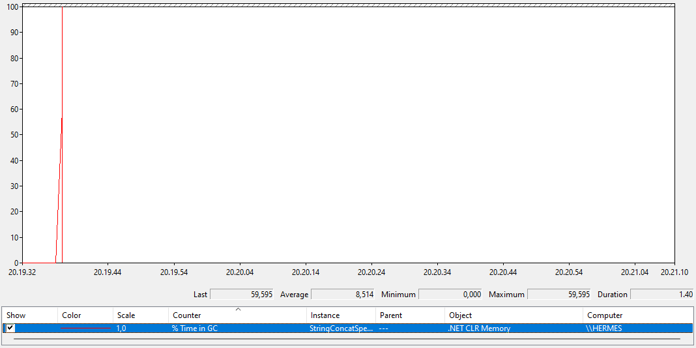
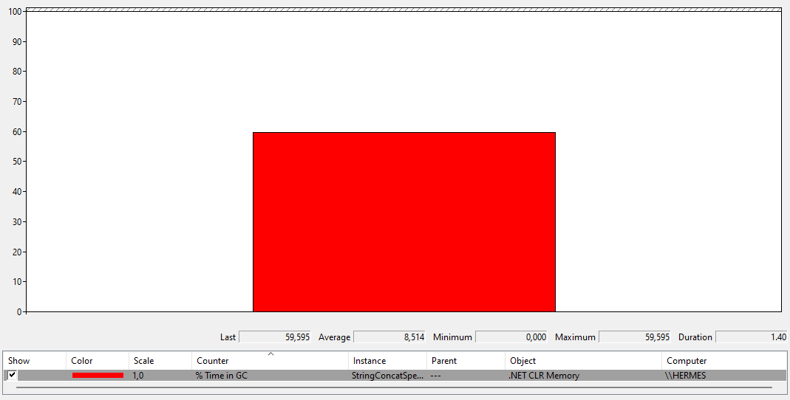
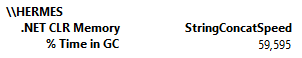

# Assignment 8

Authors: adbo, aljb and ahja

This code can also be found online at <https://github.com/andreaswachs/ITU-PRDAT22>.

We recommend reading this Markdown page on [GitHub](https://github.com/andreaswachs/ITU-PRDAT22/blob/main/assignment8/README.md) or VSCode because it makes the diffs easier to read.

## Solutions

### PLC 9.1

#### i

We have used the following link as reference: <https://en.wikipedia.org/wiki/List_of_CIL_instructions>.

```cli
    .method public static hidebysig 
           default void SelectionSort (int32[] arr)  cil managed 
    {
        // Method begins at RVA 0x20b4
	// Code size 57 (0x39)
	.maxstack 4
	.locals init (
		int32	V_0,
		int32	V_1,
		int32	V_2,
		int32	V_3)
	IL_0000:  ldc.i4.0      // Push 0 onto the stack
	IL_0001:  stloc.0       // Pop from the stack into variable index 0
	IL_0002:  br.s IL_0032  // Go to IL_0032

	IL_0004:  ldloc.0       // Load int i onto the stack
	IL_0005:  stloc.1       // Store i to variable index 1 (int least)
	IL_0006:  ldloc.0       // Load i onto the stack again
	IL_0007:  ldc.i4.1      // Push 1 onto the stack
	IL_0008:  add           // Calculate i + 1
	IL_0009:  stloc.3       // Save i + 1 in variable index 3 (int j)
	IL_000a:  br.s IL_001a  // Go to IL_001a

	IL_000c:  ldarg.0       // Get arr
	IL_000d:  ldloc.3       // Get j
	IL_000e:  ldelem.i4     // Get arr[j]
	IL_000f:  ldarg.0       // Get arr
	IL_0010:  ldloc.1       // Load least
	IL_0011:  ldelem.i4     // Get arr[least]
	IL_0012:  bge.s IL_0016 // If arr[j] >= arr[least], go to IL_0016

    // Once arr[j] < arr[least]:
	IL_0014:  ldloc.3       // Get j
	IL_0015:  stloc.1       // Set least = j
	IL_0016:  ldloc.3       // Get j
	IL_0017:  ldc.i4.1      // Push 1 onto the stack
	IL_0018:  add           // Calculate j + 1
	IL_0019:  stloc.3       // Update j = j + 1
	IL_001a:  ldloc.3       // Load i + 1 onto the stack
	IL_001b:  ldarg.0       // Load i onto the stack
	IL_001c:  ldlen         // Load the length of arr onto the stack
	IL_001d:  conv.i4       // Convert to 32 bit integer
	IL_001e:  blt.s IL_000c // If i < arr.Length, go to IL_000c

    // Once i >= arr.Length:
	IL_0020:  ldarg.0       // Get arr
	IL_0021:  ldloc.0       // Get i
	IL_0022:  ldelem.i4     // Get arr[i]
	IL_0023:  stloc.2       // Save arr[i] in variable index 2 (int tmp)
	IL_0024:  ldarg.0       // Get arr
	IL_0025:  ldloc.0       // Get i
	IL_0026:  ldarg.0       // Get arr
	IL_0027:  ldloc.1       // Get least
	IL_0028:  ldelem.i4     // Get arr[least]
	IL_0029:  stelem.i4     // Set arr[i] = arr[least]
	IL_002a:  ldarg.0       // Get arr
	IL_002b:  ldloc.1       // Get least
	IL_002c:  ldloc.2       // Get tmp
	IL_002d:  stelem.i4     // Set arr[least] = tmp
	IL_002e:  ldloc.0       // Get i
	IL_002f:  ldc.i4.1      // Push 1 onto the stack
	IL_0030:  add           // Calculate i + 1
	IL_0031:  stloc.0       // Set i = i+1
	IL_0032:  ldloc.0       // Put the value in variable index 0 onto the stack (int i)
	IL_0033:  ldarg.0       // Put the value in argument 0 onto the stack (the int[] arr)
	IL_0034:  ldlen         // Put the length of the array onto the stack (arr.Length)
	IL_0035:  conv.i4       // Convert the number to a 32-bit integer
	IL_0036:  blt.s IL_0004 // If variable in index 0 is less than the length, go to IL_0004 (i < arr.Length)

	IL_0038:  ret           // return
    } // end of method Selsort::SelectionSort
```

#### ii

We have used the following link as reference: <https://en.wikipedia.org/wiki/List_of_Java_bytecode_instructions>.

```jvmbytecode
public static void SelectionSort(int[]);
    descriptor: ([I)V
    flags: (0x0009) ACC_PUBLIC, ACC_STATIC
    Code:
      stack=4, locals=4, args_size=1
         0: iconst_0           // Push 0 onto the stack
         1: istore_1           // Store 0 in variable index 1 (int i)
         2: iload_1            // Get i
         3: aload_0            // Load a reference onto the stack from variable location 0 (int[] arr, the first argument)
         4: arraylength        // Get length of arr
         5: if_icmpge     57   // If i >= arr.length, go to 57 (return)
         8: iload_1            // Get i
         9: istore_2           // Save i to location 2 (int least)
        10: iload_1            // Get i
        11: iconst_1           // Push 1 onto the stack
        12: iadd               // Calculate i + 1
        13: istore_3           // Store i + 1 in location 3 (int j)
        14: iload_3            // Get j
        15: aload_0            // Get arr
        16: arraylength        // Get arr.length
        17: if_icmpge     37   // If j >= arr.length, go to 37
        // If j < arr.length
        20: aload_0            // Get arr
        21: iload_3            // Get j
        22: iaload             // Get arr[j]
        23: aload_0            // Get arr
        24: iload_2            // Get least
        25: iaload             // Get arr[least]
        26: if_icmpge     31   // If arr[j] >= arr[least], to to 31
        // If arr[j] < arr[least]:
        29: iload_3            // Get j
        30: istore_2           // Set least = j
        31: iinc          3, 1 // Increment value in location 3 with 1 (j++)
        34: goto          14   // Go to 14
        37: aload_0            // Get arr
        38: iload_1            // Get i
        39: iaload             // Look up arr[i]
        40: istore_3           // Set j = arr[i]
        41: aload_0            // Get arr
        42: iload_1            // Get i
        43: aload_0            // Get arr
        44: iload_2            // Get least
        45: iaload             // Get arr[least]
        46: iastore            // arr[i] = arr[least]
        47: aload_0            // Get arr
        48: iload_2            // Get least
        49: iload_3            // Get j
        50: iastore            // Set arr[least] = j
        51: iinc          1, 1 // Increment value in location 1 with 1 (i = i + 1)
        54: goto          2    // Go to instruction 2
        57: return             // return
```

### PLC 9.2

#### i

```sh
$ csc /o StringConcatSpeed.cs
Microsoft (R) Visual C# Compiler version 3.9.0-6.21124.20 (db94f4cc)
Copyright (C) Microsoft Corporation. All rights reserved.

$ mono StringConcatSpeed.exe
Initialization: Building array of small strings

Concatenate using StringBuilder:
Result length: 168894;    time:   0.000 sec


Press return to continue...


Concatenate using repeated string concatenation:
Result length: 168894;    time:   1.353 sec
```

#### ii

Perfmon was run using a Windows machine with the following specs:

- OS: Windows version 10.0.220000 (Windows 11)
- Processor: i9-12900KF
- `csc` version: 4.1.0-5.22165.10 (e555772d)

Line chart showing percent of time spent in GC:



Histogram showing the same:



A report of the same:



