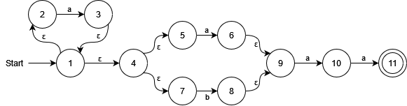
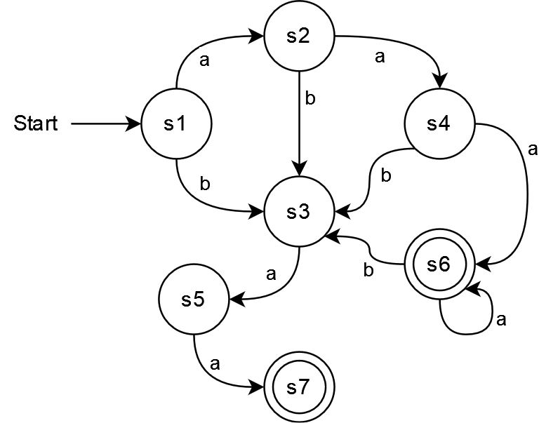

# BCD Exercise 2.2

## a) NFA

We are aware that this NFA is far from minimal. It is just using the direct rules from the book.

## b) DFA

We have used the following table to construct the DFA from the NFA:

| DFA state | move(a) | move(b) | NFA states                             |
| --------- | ------- | ------- | -------------------------------------- |
| `s1`      | `s2`    | `s3`    | `{ 1, 2, 4, 5, 7 }`                    |
| `s2`      | `s4`    | `s3`    | `{ 1, 2, 3, 4, 5, 6, 7, 9 }`           |
| `s3`      | `s5`    | `{}`    | `{ 8, 9 }`                             |
| `s4`      | `s6`    | `s3`    | `{ 1, 2, 3, 4, 5, 6, 7, 9, 10 }`       |
| `s5`      | `s7`    | `{}`    | `{ 10 }`                               |
| `*s6*`    | `s6`    | `s3`    | `{ 1, 2, 3, 4, 5, 6, 7, 9, 10, *11* }` |
| `*s7*`    | `{}`    | `{}`    | `{ *11* }`                             |

Items surrounded by `*` signify an accepting state.

Visually, the DFA is as such:

As with the NFA, this DFA is not minimal.
