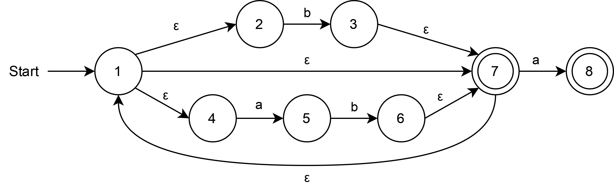

# PLC Exercise 3.2 solution

## Regular expression

We assume that the empty sequence falls under "all sequences consisting of a and b".

The following regular expression satisfies the requirements:

```regex
(b|ab)*a?
```

To demonstrate this, you can see that the correct strings are matched (and not matched) here: [https://regex101.com/r/UstCbj/1](https://regex101.com/r/UstCbj/1).

## NFA



## DFA

We have used the following table to construct the DFA from the NFA:

| DFA state | move(a) | move(b) | NFA states            |
|-----------|---------|---------|-----------------------|
| `*s1*`    | `s2`    | `s3`    | `{ 1, 2, 4, *7* }`    |
| `*s2*`    | `{}`    | `s4`    | `{ 5, *8* }`          |
| `*s3*`    | `s2`    | `s3`    | `{ 1, 2, 3, 4, *7* }` |
| `*s4*`    | `s2`    | `s3`    | `{ 1, 2, 4, 6, *7* }` |

Items surrounded by `*` signify an accepting state.
